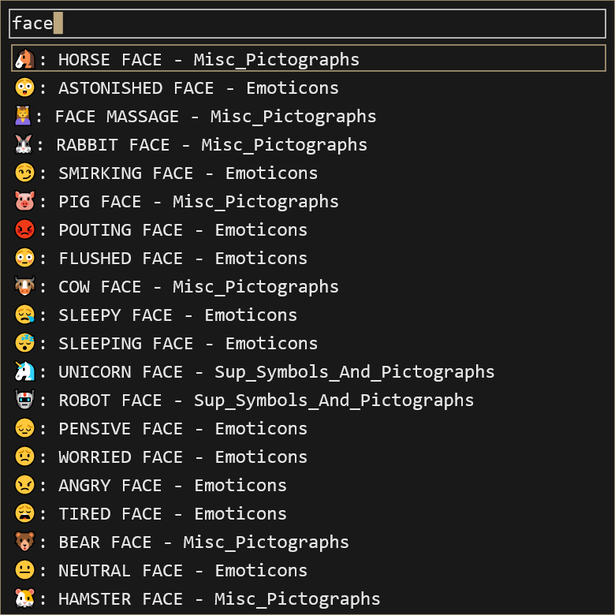

# ununi

A Unicode insertion tool that allows you to search for characters by name and block name. Triggered by Alt+F1, Escape cancels, Pause/Break kills the process.
Will automatically download the Unicode XML data if it cannot be found, if you want to update it then delete the current xml file and index directory and start ununi.

Notably this program does not always work as expected with everything because of Windows' already janky Unicode support

Built on Direct2D/DirectWrite so it is pretty tied to Windows

## Screenshot

